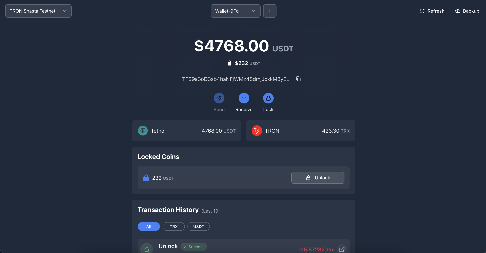
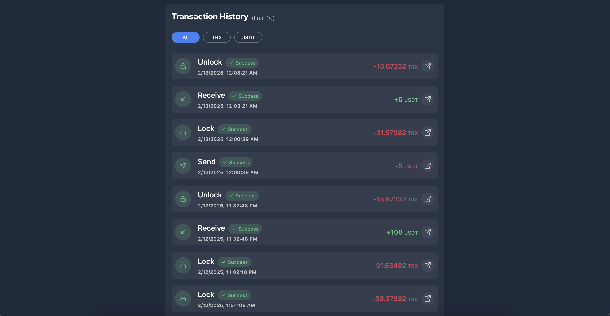
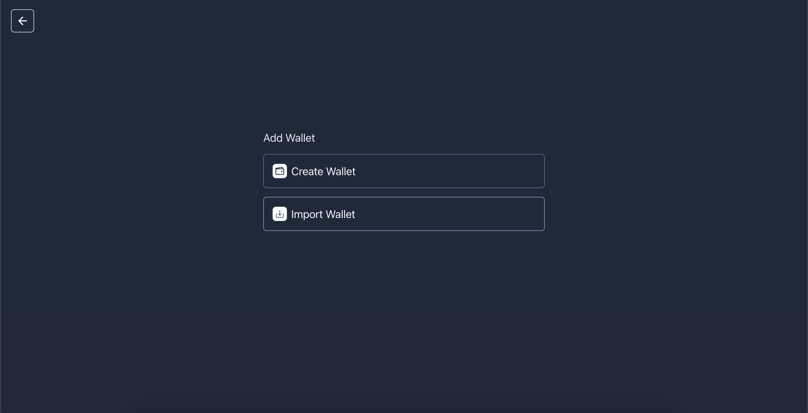
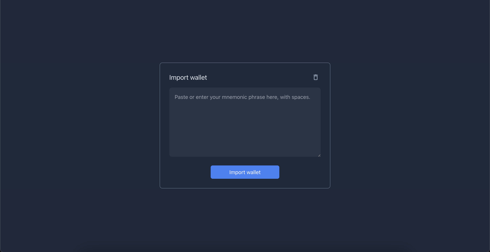

# Crypto Wallet

## Overview

Crypto Wallet is a simple cryptocurrency wallet that currently supports the TRON blockchain. It provides a user-friendly interface for managing TRX tokens and includes a unique feature to lock tokens for a specific period using a smart contract.

---

## Screenshots

Here are some screenshots of the Crypto Wallet interface:







## Live Demo

You can access the live version of the project here: [Crypto Wallet Live](https://crypto-wallet-brown.vercel.app/)


## Features

- **Supports TRON Blockchain** (Shasta Testnet & Mainnet)
- **Lock & Unlock Tokens** via smart contracts
- **User-Friendly UI** for both web and desktop (Electron)
- **Wallet Management** (Private keys & mnemonics stored in IndexedDB)
- **No Authentication Yet** (Future update planned)

## Future Enhancements

- Implement authentication
- Encrypt sensitive wallet data
- Expand support to other blockchains

---

## Installation & Setup

### Prerequisites

- **Node.js** (Latest LTS recommended)
- **Git** (for cloning the repository)

### Steps to Run the Project

1. **Clone the Repository:**
   ```sh
   git clone https://github.com/sumeet-y/crypto-wallet.git
   cd crypto-wallet
   ```
2. **Install Dependencies:**
   ```sh
   npm install
   ```
3. **Run the Web App in Development Mode:**
   ```sh
   npm run dev
   ```
4. **Run the Desktop App (Electron) in Development Mode:**
   ```sh
   npm run dev:electron
   ```

## Project Structure

```
crypto-wallet/
│── src/
│   ├── components/         # UI Components
│   ├── pages/              # App Pages
│   ├── utils/
│   │   ├── token-lock.ts   # Locking/Unlocking Tokens Logic
│   └── main.ts             # Entry point for Electron App
│── public/                 # Static Assets
│── package.json            # Project Configurations
│── README.md               # Documentation
```

## Locking & Unlocking Tokens

The logic for locking and unlocking tokens is implemented in ``. The smart contract interacts directly with the TRON blockchain to enable time-based token locking.

## Dependencies

Notable libraries used in this project:

- **TronWeb** (`tronweb`): TRON blockchain interaction
- **React** (`react`, `react-dom`): Frontend UI
- **Zustand** (`zustand`): State management
- **Mantine UI** (`@mantine/core`, `@mantine/notifications`): UI framework
- **Electron** (`electron`, `electron-builder`): Desktop app support
- **IndexedDB** (`idb`): Wallet storage (unencrypted, encryption planned)

## Contribution

Contributions are welcome! Feel free to open issues and PRs for bug fixes, improvements, or feature requests.

## License

This project is licensed under the MIT License.
